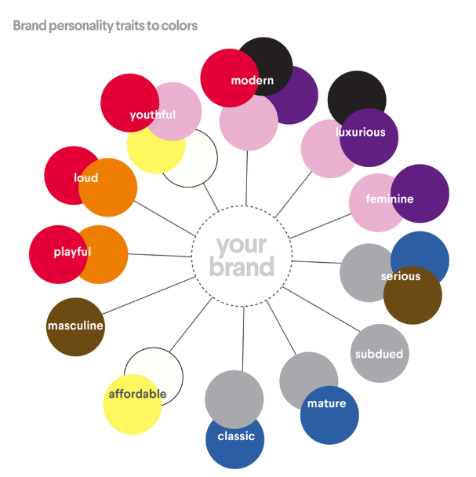

# Logo und Brand

## 🛠 Vorgehensweise

Zunächst hat die Gruppe verschiedene Farbpaletten und die mit ihnen verbundenen Eindrücke untersucht.

 

Die Gruppe stellte dem Herausgebergremium mehrer Farbvorschläge zur Verfügung, am Ende entschied das Gremium, die Datenwelten in Blau  und Türkis zu gestalten. 

